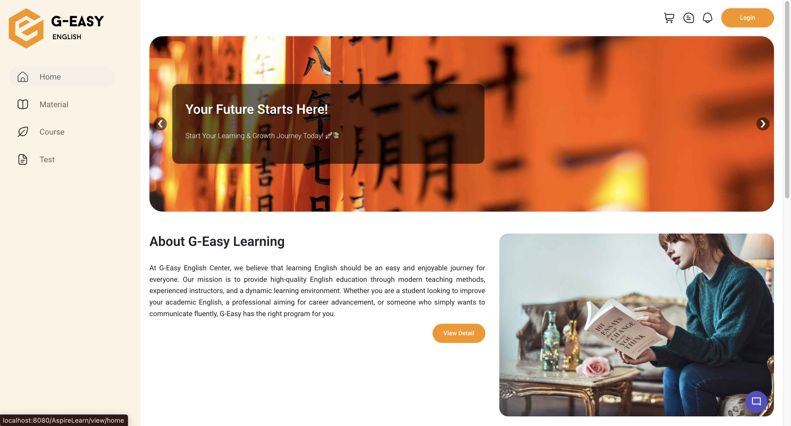

# 🎓 AspireLearn - Nền Tảng Học Tập Trực Tuyến Thông Minh



[](https://travis-ci.org/maidanghuy/PRJ301_AspireLearn)
[](LICENSE)
[](https://github.com/maidanghuy/PRJ301_AspireLearn/releases)
[](https://github.com/maidanghuy/PRJ301_AspireLearn/graphs/contributors)
[](https://github.com/maidanghuy/PRJ301_AspireLearn/commits/main)

## 📝 Tổng Quan

**AspireLearn** là một hệ thống quản lý học tập trực tuyến (LMS) hiện đại, được phát triển bởi nhóm sinh viên tại FPT University. Dự án hướng đến mục tiêu tạo ra một nền tảng học tập số hóa toàn diện, giúp người học có thể dễ dàng tiếp cận kiến thức mọi lúc, mọi nơi.

### 🎯 Mục Tiêu

- Xây dựng môi trường học tập trực tuyến thân thiện và hiệu quả
- Tối ưu hóa trải nghiệm người dùng trong quá trình học tập
- Cung cấp công cụ quản lý khóa học chuyên nghiệp cho giảng viên
- Tạo cộng đồng học tập tương tác và năng động

## ✨ Tính Năng Nổi Bật

### 👤 Quản Lý Người Dùng

- Đăng ký/đăng nhập với xác thực bảo mật
- Phân quyền chi tiết (Admin, Giảng viên, Học viên)
- Quản lý hồ sơ cá nhân với avatar
- Theo dõi lịch sử học tập
- Hệ thống thông báo thời gian thực

### 📚 Quản Lý Khóa Học

- Tạo và quản lý khóa học với giao diện trực quan
- Tổ chức nội dung theo module và bài học
- Upload và quản lý tài liệu học tập đa phương tiện
- Tích hợp video bài giảng
- Theo dõi tiến độ hoàn thành khóa học

### 📖 Quản Lý Bài Học

- Soạn thảo nội dung bài học với rich text editor
- Tích hợp các định dạng media đa dạng
- Tạo bài tập và quiz đánh giá
- Hệ thống chấm điểm tự động
- Feedback và đánh giá từ người học

### 📊 Báo Cáo & Thống Kê

- Dashboard thống kê chi tiết
- Theo dõi tiến độ học tập của học viên
- Phân tích dữ liệu tương tác
- Xuất báo cáo đa định dạng
- Đánh giá hiệu quả khóa học

## 🛠 Công Nghệ & Kiến Trúc

### Backend

- **Java Servlet/JSP**: Xử lý logic nghiệp vụ (Jakarta EE 9+)
- **JDBC**: Tương tác với database
- **Jakarta EE**: Jakarta Enterprise Edition
- **Ant Build**: Quản lý và build project
- **Gson**: Thư viện chuyển đổi Java Objects sang JSON và ngược lại

### Frontend

- **HTML5/CSS3**: Xây dựng giao diện
- **JavaScript (ES6+)**: Xử lý tương tác
- **Bootstrap 5**: Framework UI
- **jQuery**: DOM manipulation
- **AJAX**: Gọi API bất đồng bộ
- **JSON**: Định dạng dữ liệu trao đổi giữa client và server

### Database & Storage

- **SQLServer**: Lưu trữ dữ liệu
- **JDBC Driver**: Kết nối database

### Development Tools

- **NetBeans IDE**: Môi trường phát triển
- **Git**: Quản lý phiên bản
- **Apache Tomcat 10.1.34**: Web server (Jakarta EE 9+ support)
- **Ant**: Build tool

## 🔧 Hướng Dẫn Cài Đặt

### Yêu Cầu Hệ Thống

```bash
Java JDK >= 11
Apache Tomcat 10.1.34
SQLServer >= 2019
NetBeans IDE >= 8.2
Apache Ant
```

### Lưu ý quan trọng về Tomcat 10.1.34

- Tomcat 10.x sử dụng Jakarta EE 9+ thay vì Java EE
- Package names thay đổi từ `javax.*` thành `jakarta.*`
- Cần sử dụng các thư viện tương thích với Jakarta EE 9+:
  - `jakarta.servlet-api.jar` thay vì `javax.servlet.jar`
  - `jakarta.servlet.jsp-api.jar` thay vì `javax.servlet.jsp-api.jar`

### Các Bước Cài Đặt Chi Tiết

1. **Clone Repository**

```bash
git clone https://github.com/maidanghuy/PRJ301_AspireLearn.git
cd PRJ301_AspireLearn
```

2. **Cấu Hình Database**

- Mở SQLServer Management Studio
- Chạy script trong `/database/CreateDB.sql` `/database/InputDB.sql`

3. **Cấu Hình Project trong NetBeans**

- Mở NetBeans IDE
- File > Open Project > Chọn thư mục project
- Chuột phải vào project > Properties > Libraries
- Thêm các file JAR từ `LibraryForJava.zip`:
  - `sqljdbc4.jar`: SQL Server JDBC Driver
  - `jakarta.servlet-api.jar`: Jakarta Servlet API
  - `jakarta.servlet.jsp-api.jar`: Jakarta JSP API
  - Các thư viện khác cần thiết

4. **Cấu Hình Tomcat**

- Tải và giải nén Apache Tomcat 10.1.34
- Chuột phải vào project > Properties > Run
- Chọn Server: Apache Tomcat 10.1.34
- Cấu hình:
  - Server Location: đường dẫn đến thư mục Tomcat
  - Server Port: 8080 (hoặc port khác nếu cần)
  - Context Path: /AspireLearn

5. **Build & Run với Ant**

- Clean: `ant clean`
- Build: `ant compile`
- Deploy: `ant deploy`
- Hoặc sử dụng NetBeans IDE:
  - Clean and Build Project (Shift + F11)
  - Run Project (F6)

## 📁 Cấu Trúc Project

```
PRJ301_AspireLearn/
├── build/          # Compiled files
├── build.xml       # Ant build script
├── database/       # SQL scripts
├── nbproject/      # NetBeans config
├── src/
│   └── java/      # Source code
│       ├── constant/
│       ├── controllers/
│       ├── dao/
│       ├── db/
│       ├── filter/
│       ├── models/
│       └── utils/
├── web/           # Web resources
│   ├── META-INF/
│   ├── WEB-INF/
│   │   └── exel/
│   ├── assets/    # Static files
│   │   ├── css/
│   │   ├── js/
│   │   ├── images/
│   │   └── audio/
│   └── views/     # JSP files
├── .gitignore
└── README.md
```

## 👥 Team Phát Triển

### Project Manager & Technical Lead

- **Mai Đăng Huy** - [GitHub](https://github.com/maidanghuy)
  - Project planning & management
  - System architecture design
  - Backend development
  - API development
  - Bug fixing
  - Code review

### Core Development Team

- **Hoàng Minh Hiển** - [GitHub](https://github.com/minhhien2510)

  - Database Design & Implementation
  - Backend Development
    - Business Logic Implementation
  - Frontend Development
    - UI Components
    - Responsive Design
  - System Architecture Support

- **Trần Đình Quý** - [GitHub](https://github.com/TranDinhQuy-coder)

  - Content Management System
    - Course Content Structure
    - Lesson Content Management
  - Payment Integration
    - API Development
    - Payment Gateway Integration
    - Transaction Management
    - Payment Analytics
  - Documentation
    - User Guide
    - Technical Documentation

- **Nguyễn Lê Quân** - [GitHub](https://github.com/lequandev)

  - UI/UX Design
    - User Interface Design
    - User Experience Optimization
    - Design System Development
  - Testing
    - Unit Testing
    - Integration Testing
    - User Acceptance Testing
  - Quality Assurance
    - Bug Tracking
    - Performance Testing

- **Trần Văn Huy Hoàng** - [GitHub](https://github.com/huyhoang937)
  - Excel Test Implementation
    - Test Case Management
    - Result Analysis
    - Performance Metrics
  - Web Documentation
    - System Documentation
    - API Documentation
    - User Manuals
  - Content Quality Assurance
    - Content Review
    - Documentation Standards

## 📈 Roadmap

### Version 1.1 (Q2 2024)

- [ ] Tích hợp thanh toán online
- [ ] Hệ thống gamification
- [ ] Mobile responsive design
- [ ] Real-time notifications

### Version 1.2 (Q3 2024)

- [ ] Live streaming classes
- [ ] AI-powered learning recommendations
- [ ] Advanced analytics dashboard
- [ ] Mobile app development

## 📜 License

Copyright © 2024 AspireLearn Team.
Project được phân phối dưới giấy phép [MIT License](LICENSE).

## 📞 Liên Hệ & Hỗ Trợ

- **Email**: huymaidang.work@gmail.com
- **Website**: [aspirelearn.com](https://aspirelearn.com)
- **GitHub Issues**: [Report Bug](https://github.com/maidanghuy/PRJ301_AspireLearn/issues)
- **Discord**: [Join Community](https://discord.gg/NuDvgwgy)

## 🤝 Đóng Góp

Chúng tôi luôn chào đón mọi đóng góp từ cộng đồng. Xem [CONTRIBUTING.md](CONTRIBUTING.md) để biết thêm chi tiết về cách đóng góp cho dự án.

## 🙏 Cảm Ơn

Cảm ơn tất cả những người đã đóng góp cho dự án AspireLearn. Nếu bạn thấy dự án hữu ích, hãy cho chúng tôi một ⭐️!

---

<p align="center">Made with ❤️ by AspireLearn Team</p>
